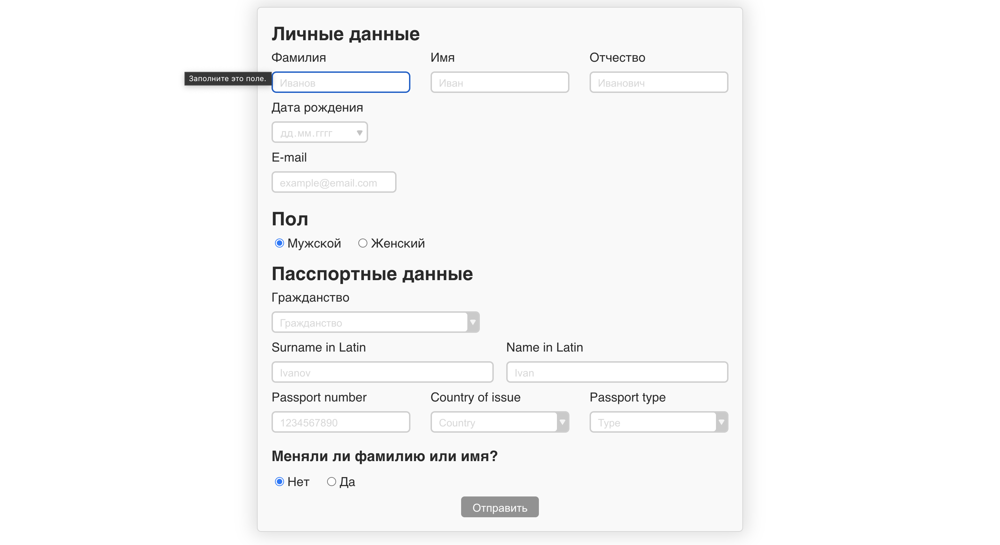

## Простая форма на Vue.js

### Форма



#

- Работает валидация полей до отправки.

- Реализованы дропдауны, которые берут данные из `src/assets/data`

- Данные собираются в `json` и отправляются в консоль.


#

### Запустить проект

```
npm run serve
```
